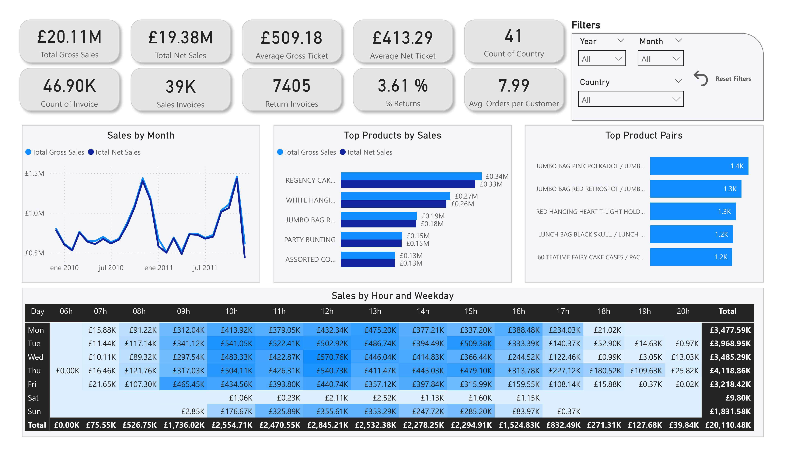

# Online Retail Analytics – Python, SQL & Power BI

📄 **This README is in English**. 
🇪🇸 [Leer en español](README_ES.md) | 🇫🇷 [Lire en Français](README_FR.md)

---
## Description  
This project is part of my Data Analytics portfolio.  
I analyze the Online Retail II dataset [(Kaggle)](https://www.kaggle.com/datasets/mashlyn/online-retail-ii-uci) applying data cleaning, exploratory analysis, and visualization techniques.  
The goal is to demonstrate technical skills in Python, SQL, and Power BI, as well as the ability to communicate business-oriented insights.

> Final cleaned Dataset:   
> 1,054,675 rows and 15 columns

---
## Technologies  
* Python (Pandas, Numpy, Seaborn, Matplotlib)
* SQL (SQLite via SQLAlchemy, queries with CTEs for aggregations)
* Power BI (interactive dashboards with DAX measures)
* Jupyter Notebook for analysis documentation

---
## Repository structure  
`/data`          → raw and cleaned datasets    
`/notebooks`     → notebooks for exploration and EDA   
`/powerbi`       → `.pbix` file with the interactive dashboard  
`/reports`       → dashboard screenshots and one-pager summary  
`requirements.txt`  
`README.md`  

> **Note on data**  
> The files in the `/data` folder are not included in the repository due to their size.  
> The original dataset can be downloaded from [Kaggle – Online Retail II](https://www.kaggle.com/datasets/mashlyn/online-retail-ii-uci).  

➡️ **Important:** Once downloaded, place it in the `/data` folder with the name `online_retail_II.csv` before running the notebooks.  

> **Note on notebooks**  
> This project includes two versions of each Jupyter Notebook: one in **English** and one in **Spanish**.  
> No further translations will be provided, since maintaining multiple languages in parallel requires significant effort.  
> Both the English and Spanish versions will remain updated to ensure consistency.

---
## Key findings

> Unless otherwise stated, values refer to Net Sales. Gross Sales is specified explicitly.
   
1. **Two main market segments**: United Kingdom accounts for 85.70% of total gross sales, while the rest of the world represents only 14.30%.  
2. **Clear seasonality**: Q4 concentrates the largest share of sales, especially gifts and decorations.  
3. **Unidentified customers**: 13.80% of net sales lack a Customer ID, limiting segmentation.  
4. **Returns below industry average**: Returns account for 15.79% of invoices, lower than the industry average (20%) – [Outvio (2024)](https://outvio.com/blog/return-rate-stats/).  

---
## Dashboard Highlights

  
*Instructions, ETL cleaning rules, and dataset limitations.*

  
*Overview: £20.11M Gross Sales, £19.38M Net Sales; Returns = 3.61%; Avg. Net Ticket = £413.29.*

  
*Top Products by Net Sales: Regency Cakestand (£327.74K), White Hanging Heart T-Light (£257.51K). Returns concentrated in a few items.*

  
*Geography: United Kingdom dominates with 85.70% of Net Sales (£16.59M). Ireland and the Netherlands follow far behind.*

  
*Sales by Hour & Weekday: strong peaks on Thursdays and midday (12h), key insight for campaign timing.*

---
## Recommendations    
1. **Seasonal campaigns**: leverage Q4 with strategic bundles of best-selling products and upselling complementary or premium items at checkout.  
2. **Customer registration program**: reduce unidentified sales by 7% within three months.  
3. **Reduce returns**: review descriptions, product images, and packaging for the top 5 products with the highest return rate (target: reduce the company’s return rate by 20% within 60 days).  
4. **Include cost information**: request and record unit cost and shipping expenses to calculate profitability and prioritize high-margin products.  

---
## Power BI Dashboard    
* **Page 1: How to Use** – Report usage instructions, assumptions, version history, and contact. 
* **Page 2: Overview** – Executive KPIs, top products and customers by sales, sales by weekday, sales vs. returns distribution, time trends. Filters: country, year, month.
* **Page 3: Products** – Product KPIs, top products by sales and returns, sales & returns over time. Filters: product, country, year.  
* **Page 4: Customers** – Customer KPIs, top customers by sales and returns, product-by-customer analysis, time trends. Filters: customer, year.  
* **Page 5: Countries** – Country KPIs, top countries by sales and average ticket, product-by-country analysis, time trends. Filters: country, year.  
* **Page 6: Sales** – Sales KPIs, time trends, top products and product pairs (static), sales heatmap by weekday and hour. Filters: country, year, month.  
* **Page 7: Returns** – Return KPIs, time trends, returns vs. sales, returns by weekday/month/year, top countries/customers/products by returns. Filters: country, customer, product, month, year.  

---
## How to run the project    

> Tested on Python 3.11.9 and pandas 2.2.3

1. Clone the repository:  
> git clone https://github.com/saul1832/online-retail-analytics.git  
> cd online-retail-analytics

2. Install dependencies:  
> pip install -r requirements.txt

3. Open notebooks in Jupyter:   
> jupyter notebook

---
## Author
Saul Huaman Alvarado  
Data Analyst (Python, SQL, Power BI) | Budget Control & Financial Reporting  

[Email](mailto:saul18_@hotmail.com) | [LinkedIn](https://www.linkedin.com/in/saulha/) | [GitHub](https://github.com/saul1832)

