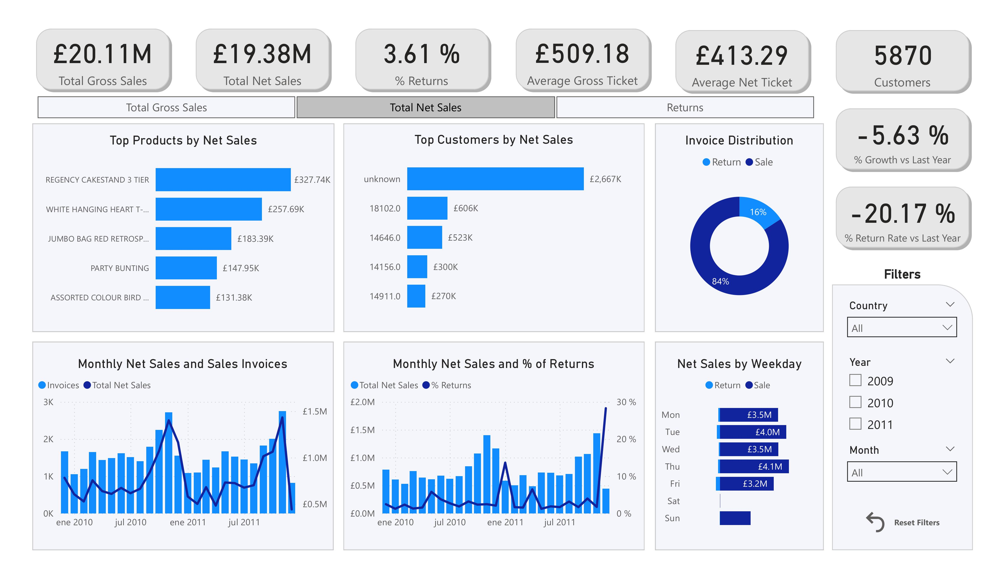
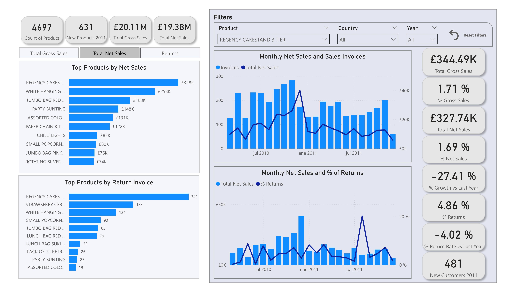
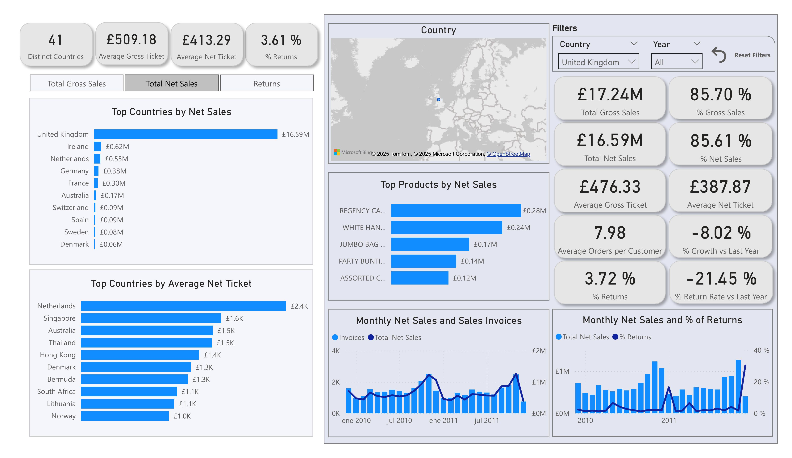
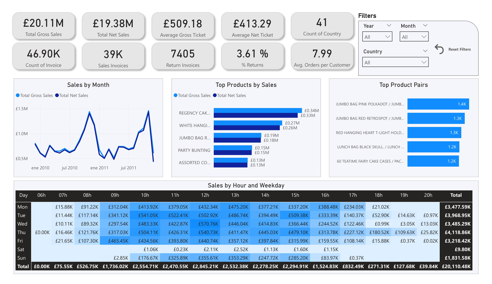

# Online Retail Analytics – Python, SQL & Power BI

📄 **Ce README est en français**.  
🌐 [Read in English](README.md) | 🇪🇸 [Leer en español](README_ES.md)

---
## Description  
Ce projet fait partie de mon portfolio en analyse de données.  
J’analyse le dataset Online Retail II [(Kaggle)](https://www.kaggle.com/datasets/mashlyn/online-retail-ii-uci) en appliquant des techniques de nettoyage des données, d’analyse exploratoire et de visualisation.  
L’objectif est de démontrer mes compétences techniques en Python, SQL et Power BI, ainsi que ma capacité à communiquer des insights orientés vers le business.  

> Jeu de données final nettoyé :   
> 1 054 675 lignes et 15 colonnes

---
## Technologies utilisées  
* Python (Pandas, Numpy, Seaborn, Matplotlib)  
* SQL (SQLite via SQLAlchemy, requêtes avec CTE pour agrégations)  
* Power BI (dashboards interactifs avec mesures DAX)  
* Jupyter Notebook pour la documentation de l’analyse  

---
## Structure du dépôt  
`/data`          → jeux de données bruts et nettoyés  
`/notebooks`     → notebooks d’exploration et d’analyse EDA  
`/powerbi`       → fichier .pbix avec dashboard interactif  
`/reports`       → captures du dashboard et résumé “one-pager”  
`requirements.txt`  
`README.md`  

> **Remarque sur les données**  
> Les fichiers du dossier `/data` ne sont pas inclus dans le dépôt en raison de leur taille.  
> Le jeu de données original peut être téléchargé depuis [Kaggle – Online Retail II](https://www.kaggle.com/datasets/mashlyn/online-retail-ii-uci).  

➡️ **Important :** Une fois téléchargé, placez-le dans le dossier `/data` sous le nom `online_retail_II.csv` avant d’exécuter les notebooks.  

> **Note sur les notebooks**  
> Ce projet inclut deux versions de chaque Jupyter Notebook : une en **anglais** et une en **espagnol**.  
> Aucune autre traduction ne sera fournie, car maintenir plusieurs langues en parallèle exige un effort considérable.  
> Les versions anglaise et espagnole resteront synchronisées pour garantir la cohérence.  

---
## Principaux résultats  

> Sauf indication contraire, les valeurs se réfèrent aux ventes nettes. Les ventes brutes sont spécifiées explicitement.

1. **Deux segments de marché principaux** : le Royaume-Uni représente 85,70 % des ventes brutes totales, tandis que le reste du monde ne représente que 14,30 %.  
2. **Saisonnalité claire** : le quatrième trimestre concentre la plus grande part des ventes, notamment les cadeaux et décorations.  
3. **Clients non identifiés** : 13,80 % des ventes nettes n’ont pas de Customer ID, ce qui limite la segmentation.  
4. **Taux de retours inférieur à la moyenne du secteur** : les retours représentent 15,79 % des factures, en dessous de la moyenne du secteur (20 %) – [Outvio (2024)](https://outvio.com/blog/return-rate-stats/).  

---
## Points forts du dashboard  

  
*Instructions, règles de nettoyage (ETL) et limites du dataset.*

  
*Vue d’ensemble : £20,11M en ventes brutes, £19,38M en ventes nettes ; retours = 3,61 % ; panier moyen net = £413,29.*

  
*Top produits par ventes nettes : Regency Cakestand (£327,74K), White Hanging Heart T-Light (£257,51K). Les retours se concentrent sur quelques articles.*

  
*Pays : le Royaume-Uni domine avec 85,70 % des ventes nettes (£16,59M). L’Irlande et les Pays-Bas arrivent loin derrière.*

  
*Ventes par heure et jour de la semaine : pics marqués le jeudi et à midi (12h), insight clé pour la planification des campagnes.*

---
## Recommandations  
1. **Campagnes saisonnières** : tirer parti du Q4 avec des bundles stratégiques de produits phares et proposer des compléments ou des produits premium au moment du paiement (upsell).  
2. **Programme d’enregistrement clients** : réduire les ventes sans ID de 7 % en trois mois.  
3. **Actions sur les retours** : revoir la description, les photos et l’emballage des 5 produits avec le plus haut taux de retour (objectif : réduire le taux de retour de l’entreprise de 20 % en 60 jours).  
4. **Inclure les informations de coûts** : demander et enregistrer le coût unitaire et les frais de livraison de chaque produit afin de calculer la rentabilité et de prioriser les articles à forte marge.  

---
## Dashboard Power BI  
* **Page 1 : How to Use** – Instructions d’utilisation du rapport, hypothèses, notes importantes, historique de version et contact.  
* **Page 2 : Overview** – KPIs exécutifs, top produits et clients par ventes, ventes par jour de la semaine, répartition ventes/retours, tendances temporelles. Filtres disponibles : pays, année, mois.  
* **Page 3 : Products** – KPIs produits, top ventes et retours, analyse temporelle des ventes et retours. Filtres : produit, pays, année.  
* **Page 4 : Customers** – KPIs clients, top ventes et retours, analyse ventes par client et produit, tendances temporelles. Filtres : client, année.  
* **Page 5 : Countries** – KPIs pays, top ventes et panier moyen, analyse ventes par produit et par pays, tendances temporelles. Filtres : pays, année.  
* **Page 6 : Sales** – KPIs ventes, tendances temporelles, top produits et paires de produits (statique), heatmap des ventes par jour de la semaine et heure. Filtres : pays, année, mois.  
* **Page 7 : Returns** – KPIs retours, tendances temporelles, retours vs. ventes, retours par jour/semaine/mois/année, top pays, clients et produits. Filtres : pays, client, produit, mois, année.  

---
## Comment exécuter le projet  

> Testé avec Python 3.11.9 et pandas 2.2.3

1. Cloner ce dépôt :  
> git clone https://github.com/saul1832/online-retail-analytics.git  
> cd online-retail-analytics

2. Installer les dépendances :  
> pip install -r requirements.txt

3. Ouvrir les notebooks dans Jupyter :  
> jupyter notebook

---
## Auteur  
Saúl Huamán Alvarado  
Data Analyst (Python, SQL, Power BI) | Contrôle budgétaire & Reporting financier  

[Email](mailto:saul18_@hotmail.com) | [LinkedIn](https://www.linkedin.com/in/saulha/) | [GitHub](https://github.com/saul1832)
